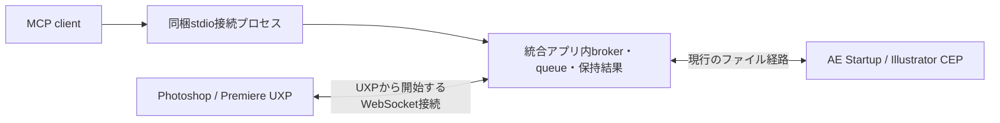

# Adobe MCP desktop app（実装・検証中）

`adobe-mcp-app` は、5 hostのTCP brokerを同一プロセス内で動かすWindows / macOS向けアプリ。Windows通知領域／macOSメニューバーから状態確認・host別の受付開始／停止・診断・ログイン起動・終了を行う。別の監視daemonは起動しない。

## 起動と設定

```sh
cargo run -p adobe-mcp-app
```

既存の `ae-mcp serve-stdio` などの接続コマンドと、host別のTCPアドレスは維持する。Adobe内のbridgeは別途導入する。アプリの起動だけでは、Adobe内のplugin / Startup scriptの導入や有効化はできない。

通常のアプリ設定は `Documents/adobe-mcp/application.toml`。設定・ログ・ロックの配置先は `--data-dir` で変更できる。テストは作業ディレクトリ内の専用profileとhost設定で行い、既存bridge root・ポートを共有しない。

```toml
[hosts.aftereffects]
enabled = true
# 省略すると既存CLIと同じ既定値。明示する場合はCLIにも同じ設定を渡す。
config = "ae.toml"

[hosts.photoshop]
enabled = false
```

host IDは `aftereffects` / `premiere` / `photoshop` / `illustrator` / `indesign`。未指定hostは有効。`config` はアプリ設定ファイルからの相対パス、または絶対パス。bridgeのheartbeatがない場合は「Waiting for Adobe bridge」と表示する。Adobeが終了中なのか、bridgeが読み込まれていないのかは、この表示だけでは判定しない。

同一profileの二重起動はOSのファイルロックで防ぐ。別profileを明示しても、使用中のhostポートは奪わない。起動失敗時はhostメニューと診断JSONに理由を表示し、Retry startで再試行できる。

## 停止・移行

「Stop receiving」と「Quit Adobe MCP」は、新しいcommandの受付を原子的に止め、受付済みの処理が完了するまで待つ。クライアントがtimeoutしても、Adobe側の実行が終わるまで待機数に含める。結果未確定の処理は経過時間だけで強制終了・再投入しない。待機中はresult照会・cancel要求を受け付ける。

旧host別daemonが動いていると同じポートにbindできず、該当hostは要確認になる。既存daemonを自動killする移行は行わない。保持requestに未確定の処理がないことを確認したうえで、旧daemon・旧ログイン登録から統合アプリへ切り替える。現在のインストーラーの旧daemon登録は、この試作では自動置換しない。

統合アプリは `app-runtime.pid` を使い、旧CLIの停止対象 `daemon.pid` を上書きしない。「Start at login」は統合アプリ用の登録のみを変更する。旧host別登録を無効にしてから有効化する。アプリ実行ファイルを移動した場合は再登録が必要。

## UXP受信処理の修正

Photoshop / Premiereのファイル経路はUXPの `mkdir(path)`、パス指定の `writeFileSync`、非同期の `rename` / `unlink` に合わせた。Node.jsにある `openSync` / `renameSync` / `unlinkSync` は使わない。既存ファイルへの置換失敗時は前の内容を残す。scriptに公開している `helpers.writeTextFile` / `helpers.writeJsonFile` もPromiseを返すため、呼び出し側で `await` する。

pluginの読み込み時に自動受信を開始し、panelのhide / destroyで受信timerを止めない。pluginのdestroyで終了する。これはホストがpluginをロードしている間の動作であり、すべてのAdobe版でpluginの自動ロードや非表示時の実行を保証するものではない。Photoshopの既存 `loadEvent: startup` は維持する。Premiereのmanifestへ未検証の起動設定は追加していない。

このPCで確認した旧Illustrator配置には、#39で修正された `File.rename` 後の参照先変化の問題が残っていた。Gitの修正とインストール済みbridgeの更新は別作業。制作中のホストへこのブランチを自動配布していない。

## UXPの直接通信への移行案

現状のqueueはRustの `InstanceScheduler` 内のFIFO。JSONファイルはcommand / result / heartbeatの交換と復旧用記録に使っている。UXPホストでは交換部分をローカルWebSocketへ置き換える方針が適切。**このブランチの現時点ではWebSocket通信は未実装**。



- 統合アプリだけがloopbackで待受し、UXPが接続する。命令・受領通知・結果・状態を同じ接続で送る。
- pluginロード時に接続し、起動順やsleepに依存せずbackoff付きで再接続する。パネル操作は接続開始条件にしない。
- `instanceId` / session / `requestId` を照合する。切断時に実行済みか不明なcommandを再送しない。結果をアプリが保存してackするまでUXPが保持し、再接続時に照合・再送する。
- transport切替はcommandを受け付ける前に決める。実行途中の切断からファイル経路へ自動再投入しない。
- queue・排他・保持結果の責任は統合アプリ側に置く。JSON自体を廃止する必要はなく、通信ペイロードとして使用できる。
- loopback制限・接続先allowlist・認証を設ける。manifest権限とmacOSのローカル接続／TLS制約はhost・versionごとに実測する。

HTTP pollingは代替候補だが周期的な問い合わせと待ち時間が残る。long pollingも実現可能。UXPはWebSocket clientのみを提供するため、UXPへ外部から直接Webhookを配信する構成は採用しない。

Adobeの2026年9月発表ではCEP廃止は2029年末、AE UXP公開betaは2026年11月、Illustratorは2027年春の予定。ExtendScriptはこの廃止の対象外。現時点でAE / Illustratorを公開されていないUXP APIへ置き換えることはしない。

出典：[Adobeの移行方針](https://blog.developer.adobe.com/en/publish/2026/09/investing-in-the-future-of-creative-cloud-extensibility-uxp-comes-to-our-flagship-applications)、[UXP通信API](https://developer.adobe.com/premiere-pro/uxp/resources/recipes/network/)、[UXP fs API](https://developer.adobe.com/photoshop/uxp/2021/uxp/reference-js/Modules/FileSystem/)。確認日：2026-10-08。

## 検証範囲

契約テストは既存CIの `cargo test -p bridge-contract-tests` からNode.jsのUXPテストも実行する。ローカル検証にはRustに加えてNode.js 20以上が必要。

- Rustテスト：client timeout後のdrain、受付拒否、遅延結果の保存、PID・portの解放、既存queue／保持結果契約。
- Nodeテスト：UXPで提供されるfs APIだけを模擬し、自動受信・連続置換・失敗時の旧ファイル保持・hidden panel・destroy中のtimer再生成防止を確認。
- Adobe実機、Windows通知領域の見た目と操作、macOSメニューバー、ログイン起動、sleep/modal、署名済み配布と旧daemonの移行は別途E2Eが必要。#22の実機検証項目をこの変更だけで完了扱いにしない。
