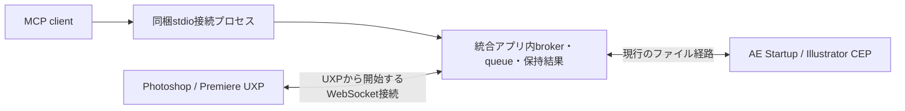

# Adobe MCP desktop app（実装・検証中）

`adobe-mcp-app` は、5 hostのTCP brokerを同一プロセス内で動かすWindows / macOS向けアプリ。Windows通知領域／macOSメニューバーから状態確認・host別の受付開始／停止・診断・ログイン起動・終了を行う。別の監視daemonは起動しない。

Windowsのベータ配布・旧版からの更新手順は [Windows beta guide](windows-beta.md) を参照。

## 起動と設定

```sh
cargo run -p adobe-mcp-app
```

既存の `ae-mcp serve-stdio` などの接続コマンドと、host別のTCPアドレスは維持する。Adobe内のbridgeは別途導入する。アプリの起動だけでは、Adobe内のplugin / Startup scriptの導入や有効化はできない。

通常のアプリ設定は `Documents/adobe-mcp/application.toml`。設定・ログ・ロックの配置先は `--data-dir` で変更できる。テストは作業ディレクトリ内の専用profileとhost設定で行い、既存bridge root・ポートを共有しない。

```toml
[hosts.aftereffects]
enabled = true
# 省略すると既存CLIと同じ既定値。明示する場合はCLIにも同じ設定を渡す。
config = "ae.toml"

[hosts.photoshop]
enabled = false
```

host IDは `aftereffects` / `premiere` / `photoshop` / `illustrator` / `indesign`。未指定hostは有効。`config` はアプリ設定ファイルからの相対パス、または絶対パス。bridgeのheartbeatがない場合は「Waiting for Adobe bridge」と表示する。Adobeが終了中なのか、bridgeが読み込まれていないのかは、この表示だけでは判定しない。

同一profileの二重起動はOSのファイルロックで防ぐ。別profileを明示しても、使用中のhostポートは奪わない。起動失敗時はhostメニューと診断JSONに理由を表示し、Retry startで再試行できる。

## アイコンの状態

通知領域／メニューバーの「Mc」は、1秒ごとにサーバーの受付状態を確認する。

- カラー：有効なhostが1つ以上あり、有効な全hostのbrokerが正常に受付中。Adobe未起動でbridge接続を待っている場合も正常待機とする。
- グレー：全hostを停止、起動失敗、状態取得失敗、有効hostの終了・受付停止、またはアプリ終了処理中。
- 意図的に無効にしたhostは正常判定から除く。接続しているAdobe instanceや個々の停止理由はhostメニューで確認する。色だけではAdobe内のscript実行成功を保証しない。

tooltipにも状態を表示する。アプリ終了後は通知領域からアイコン自体が消える。macOSでもカラー／グレーを区別するため、template imageによる自動単色化は使用しない。Windowsの実行ファイル／ショートカット用アイコンは固定のカラー版。

制作元は`assets/icons/adobe-mcp-app-icon-master.psd`（1024px）と`adobe-mcp-tray-icon-master.psd`（64px）。sRGB・RGB 8bit、Myriad Pro Boldの編集可能な「Mc」と角丸シェイプを、`正常 / Active`／`停止・異常 / Inactive`グループに分けている。旧Aは非表示の埋め込みSmart Objectとして保持する。PNGはトレイへ埋め込み、`adobe-mcp.ico`はWindowsリソースとしてbuild時に組み込む。`adobe-mcp.icns`はmacOS app bundle用の素材で、bundleへの組み込み・実機確認は未実施。

## 停止・移行

「Stop receiving」と「Quit Adobe MCP」は、新しいcommandの受付を原子的に止め、受付済みの処理が完了するまで待つ。クライアントがtimeoutしても、Adobe側の実行が終わるまで待機数に含める。結果未確定の処理は経過時間だけで強制終了・再投入しない。待機中はresult照会・cancel要求を受け付ける。

旧host別daemonが動いていると同じポートにbindできず、該当hostは要確認になる。既存daemonを自動killする移行は行わない。保持requestに未確定の処理がないことを確認したうえで、旧daemon・旧ログイン登録から統合アプリへ切り替える。現在のインストーラーの旧daemon登録は、この試作では自動置換しない。

統合アプリは `app-runtime.pid` を使い、旧CLIの停止対象 `daemon.pid` を上書きしない。「Start at login」は統合アプリ用の登録のみを変更する。旧host別登録を無効にしてから有効化する。アプリ実行ファイルを移動した場合は再登録が必要。

## UXP受信処理の修正

Photoshop / Premiereのファイル経路はUXPの `mkdir(path)`、パス指定の `writeFileSync`、非同期の `rename` / `unlink` に合わせた。Node.jsにある `openSync` / `renameSync` / `unlinkSync` は使わない。既存ファイルへの置換失敗時は前の内容を残す。scriptに公開している `helpers.writeTextFile` / `helpers.writeJsonFile` もPromiseを返すため、呼び出し側で `await` する。

pluginの読み込み時に自動受信を開始し、panelのhide / destroyで受信timerを止めない。pluginのdestroyで終了する。これはホストがpluginをロードしている間の動作であり、すべてのAdobe版でpluginの自動ロードや非表示時の実行を保証するものではない。Photoshopの既存 `loadEvent: startup` は維持する。Premiereのmanifestへ未検証の起動設定は追加していない。

このPCで確認した旧Illustrator配置には、#39で修正された `File.rename` 後の参照先変化の問題が残っていた。Gitの修正とインストール済みbridgeの更新は別作業。制作中のホストへこのブランチを自動配布していない。

## UXPのWebSocket通信

Photoshop / Premiere UXPのcommand / result / heartbeat交換はローカルWebSocketを使用する。queueは既存のRust `InstanceScheduler` 内のFIFO、保持履歴はアプリ側のregistry JSON。新しいUXPはファイルのcommand / result / heartbeatを生成・監視しない。



- 統合アプリだけがloopbackで待受し、UXPが接続する。命令・受領通知・結果・状態を同じ接続で送る。
- pluginロード時に接続し、起動順やsleepに依存せずbackoff付きで再接続する。パネル操作は接続開始条件にしない。
- `instanceId` / session / `requestId` を照合する。切断時に実行済みか不明なcommandを再送しない。結果をアプリが保存してackするまでUXPが保持し、再接続時に照合・再送する。
- transport切替はcommandを受け付ける前に決める。実行途中の切断からファイル経路へ自動再投入しない。
- queue・排他・保持結果の責任は統合アプリ側に置く。JSON自体を廃止する必要はなく、通信ペイロードとして使用できる。
- サーバーは `127.0.0.1` だけにbindする。同じポートで既存TCP brokerとWebSocket Upgradeを識別する。UXPは `localhost` の明示ポートだけをmanifestで許可し、接続先検証と256bitのランダムtokenで認証する。macOSのローカル接続／TLS制約は別途実測が必要。

アプリ（またはこの版の `ps-mcp/pr-mcp serve-daemon`）がhostのbridge rootに `connection.json` を生成する。これは接続先・token・protocol version・transportのbootstrap設定で、コマンドのキューではない。UXPは接続時に読み、稼働中はWebSocketのheartbeatを使う。tokenをログ・Gitへ含めない。通常は `Documents/ps-mcp-bridge` / `Documents/pr-mcp-bridge`。独自ポートを使う開発環境では、UXP manifestの `ws://localhost:PORT` / `http://localhost:PORT` も同じポートに変更してUnload→Loadする。任意の外部ドメインを許可する `all` は不要。

旧版との互換接続は `connection.json` の `transport` を `file` にしてpluginを再ロードする。通信障害による自動切替はしない。file方式から移行するときも実行中requestを解決してから切り替える。

結果のACKはregistryをatomic write・syncした後に返す。client timeout・切断時も既存workerがFIFO・host内global排他を保持する。アプリが再起動した場合は、保存済みのdispatch記録から未解決requestを検出し、元のUXP sessionから結果を回収するまでhostの新規commandを停止する。

**復旧の限界**：ACK前の結果はUXPメモリに保持する。Adobe終了・plugin再ロードでsessionそのものを失った場合は、その結果を自動復元できない。requestを `unknown` のまま保持し、実行済みか不明な処理は再送しない。元のhost処理が確実に終了したことを確認し、対象requestの内容を調べたうえで運用上の復旧判断が必要。未解決を時間経過だけで成功／失敗に変えない。

HTTP pollingは代替候補だが周期的な問い合わせと待ち時間が残る。long pollingも実現可能。UXPはWebSocket clientのみを提供するため、UXPへ外部から直接Webhookを配信する構成は採用しない。

Adobeの2026年9月発表ではCEP廃止は2029年末、AE UXP公開betaは2026年11月、Illustratorは2027年春の予定。ExtendScriptはこの廃止の対象外。現時点でAE / Illustratorを公開されていないUXP APIへ置き換えることはしない。

出典：[Adobeの移行方針](https://blog.developer.adobe.com/en/publish/2026/09/investing-in-the-future-of-creative-cloud-extensibility-uxp-comes-to-our-flagship-applications)、[UXP通信API](https://developer.adobe.com/premiere-pro/uxp/resources/recipes/network/)、[UXP fs API](https://developer.adobe.com/photoshop/uxp/2021/uxp/reference-js/Modules/FileSystem/)。確認日：2026-10-08。

## 検証範囲

契約テストは既存CIの `cargo test -p bridge-contract-tests` からNode.jsのUXPテストも実行する。ローカル検証にはRustに加えてNode.js 20以上が必要。

- Rustテスト：WebSocketの認証・host/session照合、切断後の結果回収・重複ACK、切断中のglobal排他保持、再起動後の受付保護。既存のclient timeout後のdrain、受付拒否、遅延結果保存、PID・portの解放、queue／保持結果契約も継続。
- Nodeテスト：UXPの自動接続、未ACK結果の再送、重複commandの実行抑止、panel非表示中の接続維持、WebSocket経路で交換ファイルを作らないこと。互換file方式の連続置換・失敗時の旧ファイル保持・destroy中のtimer再生成防止も確認。
- Windows実機（2026-10-08）：Photoshop 26.11.7 / Premiere Pro 25.6.6。別IDの開発plugin・別profileを用い、WebSocket認証、MCP stdio→統合broker→実Adobeのping、読み取り専用raw codeを確認。両ホストのパネル非表示でも受信継続。両ホストでclient timeout後・実行中に検証用アプリを再起動し、元のsessionの結果を回収、実行回数1回を確認。制作ドキュメントは変更しない。
- Windows MSI（2026-10-08）：旧0.5.1のMSIを0.5.3 betaへ更新し、手動導入されたユーザー版の既知exeをバックアップへ退避。Codexの5 commandだけを更新し、その他の設定行・統合アプリ設定・個別変更されたAE runtimeの保持を確認。Photoshop/Premiere UXPとInDesign Startup Scriptの導入成功、同一アプリプロセスによる5ポートの待受を確認。
- macOS実機、別PCでの新規導入、ログイン起動、sleep/modal、長時間運転、署名済み配布は別途E2Eが必要。#22の全実機検証項目をこの変更だけで完了扱いにしない。

wire schemaと復旧規約は [WebSocket protocol](websocket-protocol.md) を参照。
